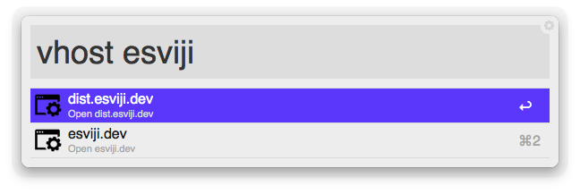

‹# Alfred VHOST Workflow

## `vhost <pattern>`

Alfred Nginx localhost VHOST finder. It parses the *.conf files and finds every `.dev` hosts declared in `server_name` instruction. You can filter results by passing an optional `<pattern>` param.

## `vhost add <host>`

Create a new vhost in your Nginx configuration. It takes the current selected folder in Finder (the selected or the front window available) and creates a new vhost using this folder as root, and `<host>.dev` as hostname.
